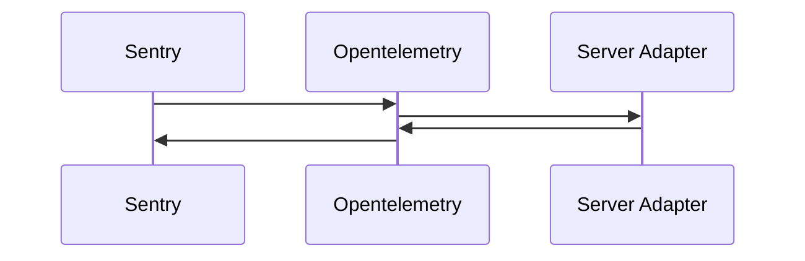
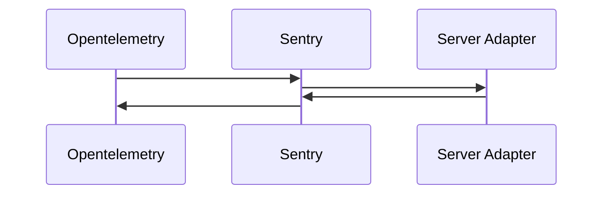

Add new Instruments API

Introducation of a new API allowing to instrument the graphql pipeline.

This new API differs from already existing Hooks by not having access to intup/output of phases. The
goal of `Instruments` is to run allow running code before, after or araound the **whole process of a
phase**, incuding plugins hooks executions.

The main use case of this new API is observability (monitoring, tracing, etc...).

### Basic usage

```ts
import Sentry from '@sentry/node'
import { createServerAdapter } from '@wahtwg-node/server'

const server = createServerAdapter(
  (req, res) => {
    //...
  },
  {
    plugins: [
      {
        instruments: {
          request: ({ request }, wrapped) =>
            Sentry.startSpan({ name: 'Graphql Operation' }, async () => {
              try {
                await wrapped()
              } catch (err) {
                Sentry.captureException(err)
              }
            })
        }
      }
    ]
  }
)
```

### Mutliple instruments plugins

It is possilbe to have multiple instruments plugins (Prometheus and Sentry for example), they will
be automatically composed by envelop in the same order than the plugin array (first is outtermost,
last is inner most).

```ts
import { createServerAdapter } from '@wahtwg-node/server'

const getEnveloped = createServerAdapter(
  (req, res) => {
    //...
  },
  { plugins: [useSentry(), useOpentelemetry()] }
)
```



### Custom instruments ordering

If the default composition ordering doesn't suite your need, you can mannually compose instruments.
This allows to have a different execution order of hooks and instruments.

```ts
import { composeInstruments, createServerAdapter } from '@wahtwg-node/server'

const { instruments: sentryInstruments, ...sentryPlugin } = useSentry()
const { instruments: otelInstruments, ...otelPlugin } = useOpentelemetry()
const instruments = composeInstruments([otelInstruments, sentryInstruments])

const getEnveloped = createServerAdapter(
  (req, res) => {
    //...
  },
  { plugins: [{ instruments }, sentryPlugin, otelPlugin] }
)
```


